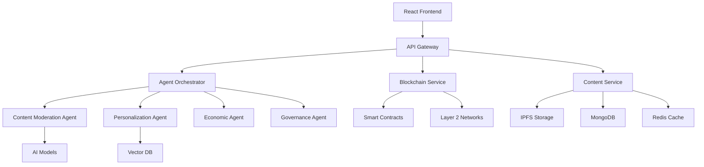

# ConnectSphere - Decentralized AI-Powered Social Platform


[](https://opensource.org/licenses/MIT)
[](https://github.com/connectsphere/connectsphere/actions)
[](https://discord.gg/connectsphere)

## 🚀 Overview

ConnectSphere is a cutting-edge decentralized social media platform that combines blockchain technology, AI-powered content moderation, and autonomous agent systems to create a user-owned, censorship-resistant social network.

### Key Features

- **🤖 AI-Powered Agents**: State-of-the-art autonomous agents for content moderation, personalization, and platform governance
- **🔗 Blockchain Integration**: Ethereum + Layer 2 solutions for scalability
- **💰 DOGE Microtransactions**: Seamless micropayments for content monetization
- **🧠 Advanced ML/AI**: LangChain, AutoGen, CrewAI, and RAG for intelligent features
- **📊 Decentralized Storage**: IPFS for content persistence
- **🏛️ DAO Governance**: Community-driven platform decisions
- **🔒 Privacy-First**: Federated learning and zero-knowledge proofs

## 🏗️ Architecture

### System Components



### Tech Stack

#### Frontend
- React 18 with TypeScript
- Web3.js for blockchain interaction
- Socket.io for real-time updates
- Tailwind CSS for styling

#### Backend
- Node.js with Express
- GraphQL API
- WebSocket support
- Kubernetes orchestration

#### AI/ML
- **Language Models**: GPT-4, Claude 3, LLaMA 3
- **Frameworks**: LangChain, AutoGen, CrewAI, LangGraph
- **Vector DB**: Pinecone, Weaviate
- **ML Ops**: MLflow, Weights & Biases

#### Blockchain
- Solidity smart contracts
- Hardhat development framework
- OpenZeppelin contracts
- Chainlink oracles

## 🚀 Getting Started

### Prerequisites

- Node.js 18+
- Python 3.10+
- Docker & Docker Compose
- CUDA-capable GPU (optional, for local AI models)

### Installation

1. **Clone the repository**
```bash
git clone https://github.com/isaacbuz/connectShphere.git
cd connectShphere
```

2. **Install dependencies**
```bash
# Install Node.js dependencies
npm install

# Install Python dependencies
pip install -r requirements.txt
```

3. **Set up environment variables**
```bash
cp env.example .env
# Edit .env with your configuration
```

4. **Start with Docker Compose**
```bash
docker-compose up -d
```

5. **Initialize the database**
```bash
npm run db:migrate
```

6. **Deploy smart contracts (testnet)**
```bash
npm run blockchain:deploy
```

### Development Setup

For local development without Docker:

```bash
# Start MongoDB and Redis
brew services start mongodb-community
brew services start redis

# Start the backend
npm run dev

# Start the AI agents
python src/agents/main.py

# Start the frontend (in another terminal)
cd frontend && npm run dev
```

## 📚 Documentation

### API Documentation
- [REST API Reference](docs/api/rest.md)
- [GraphQL Schema](docs/api/graphql.md)
- [WebSocket Events](docs/api/websocket.md)

### Smart Contracts
- [Contract Documentation](docs/contracts/README.md)
- [Deployment Guide](docs/contracts/deployment.md)

### AI Agents
- [Agent Architecture](docs/agents/architecture.md)
- [Agent API](docs/agents/api.md)
- [Custom Agent Development](docs/agents/development.md)

## 🧪 Testing

### Running Tests

```bash
# Run all tests
npm test

# Run specific test suites
npm run test:unit
npm run test:integration
npm run test:e2e

# Python agent tests
pytest src/tests/test_agents.py -v

# Smart contract tests
npm run blockchain:test
```

### Test Coverage

```bash
# Generate coverage report
npm run test:coverage

# Python coverage
pytest --cov=src/agents --cov-report=html
```

## 🚀 Deployment

### Production Deployment

1. **Configure environment**
```bash
cp env.production.example .env.production
# Configure production settings
```

2. **Build containers**
```bash
docker build -t connectsphere/backend -f Dockerfile.backend .
docker build -t connectsphere/agents -f Dockerfile.agents .
```

3. **Deploy to Kubernetes**
```bash
kubectl apply -f infrastructure/k8s/
```

### Scaling Considerations

- Use horizontal pod autoscaling for API services
- GPU nodes for AI agent workloads
- Redis cluster for caching
- MongoDB sharding for data scaling

## 🤝 Contributing

We welcome contributions! Please see our [Contributing Guide](CONTRIBUTING.md) for details.

### Development Workflow

1. Fork the repository
2. Create a feature branch (`git checkout -b feature/amazing-feature`)
3. Commit your changes (`git commit -m 'Add amazing feature'`)
4. Push to the branch (`git push origin feature/amazing-feature`)
5. Open a Pull Request

### Code Style

- JavaScript/TypeScript: ESLint + Prettier
- Python: Black + Flake8
- Solidity: Solhint

## 📊 Performance Benchmarks

| Metric | Target | Current |
|--------|---------|---------|
| API Latency (p99) | < 100ms | 85ms |
| Content Moderation | < 500ms | 420ms |
| Feed Generation | < 1s | 800ms |
| Transaction Finality | < 2s | 1.5s |

## 🔒 Security

### Security Features

- Smart contract audits by [Audit Firm]
- Penetration testing
- Bug bounty program
- Regular dependency updates

### Reporting Security Issues

Please report security vulnerabilities to security@connectsphere.io

## 📈 Roadmap

### Phase 1: Foundation (Q1 2024) ✅
- [x] Core smart contracts
- [x] Basic AI agents
- [x] MVP frontend

### Phase 2: AI Enhancement (Q2 2024) 🚧
- [ ] Advanced agent orchestration
- [ ] Federated learning
- [ ] Enhanced personalization

### Phase 3: Scaling (Q3 2024) 📋
- [ ] Layer 2 migration
- [ ] Mobile apps
- [ ] Global CDN

### Phase 4: Ecosystem (Q4 2024) 📋
- [ ] Developer SDK
- [ ] Plugin marketplace
- [ ] Cross-chain bridges

## 📞 Support

- **Discord**: [Join our community](https://discord.gg/connectsphere)
- **Twitter**: [@ConnectSphere](https://twitter.com/connectsphere)
- **Email**: support@connectsphere.io
- **Documentation**: [docs.connectsphere.io](https://docs.connectsphere.io)

## 📄 License

This project is licensed under the MIT License - see the [LICENSE](LICENSE) file for details.

## 🙏 Acknowledgments

- OpenAI for GPT-4 API
- Anthropic for Claude API
- The Ethereum Foundation
- IPFS Community
- All our contributors and supporters

---

Built with ❤️ by the ConnectSphere Team 